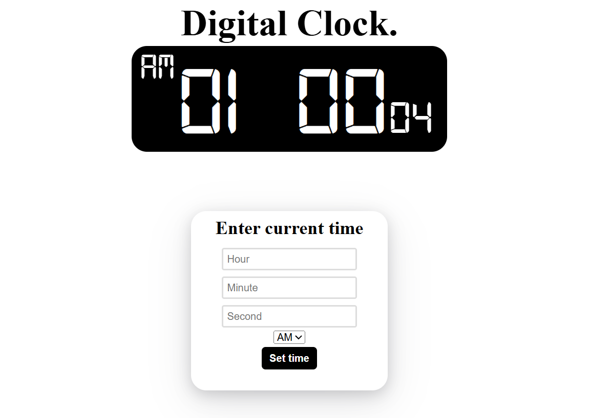

# 🕒 Digital Clock with Time Setting | HTML • CSS • JavaScript

A stylish and interactive digital clock that not only displays the current time but also allows users to **set and adjust the time manually**. Built with HTML, CSS, and JavaScript, this clock is both visually appealing and functionally robust—perfect for learning or enhancing your web development skills!

## 🔥 Features

- ⏰ **Real-time Clock Display**
- 🛠️ **Set Custom Time**
- 💅 **Attractive & Responsive UI**
- 🌙 Optional **Dark/Light Theme** *(if applicable)*
- 🖥️ Works in all modern browsers

## 📸 Screenshot

> 



## 🚀 Live Demo

> 

[🌐 View Live Demo](https://manojbhattaraii.github.io/digital-clock/)

## 🧰 Tech Stack

- **HTML5**
- **CSS3**
- **JavaScript**

## 📦 How to Use

1. **Clone the repository**
   ```bash
   git clone https://github.com/your-username/digital-clock.git
